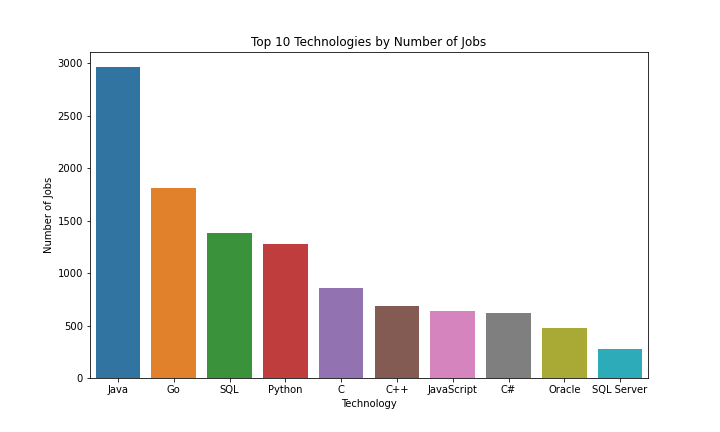
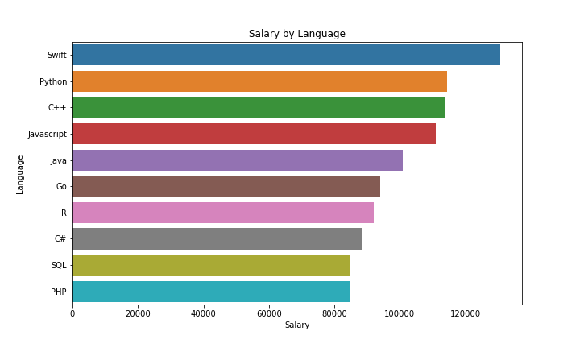
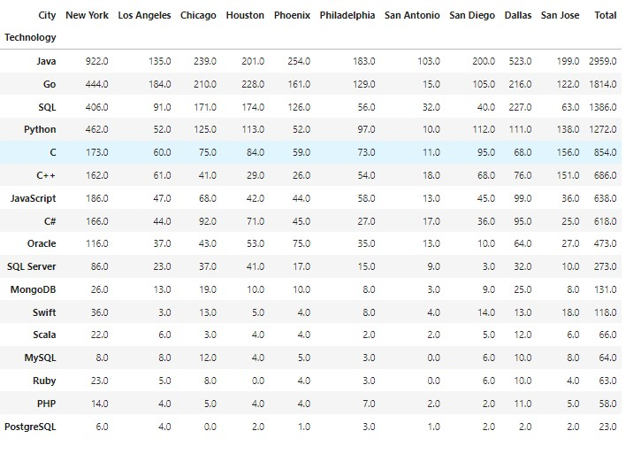
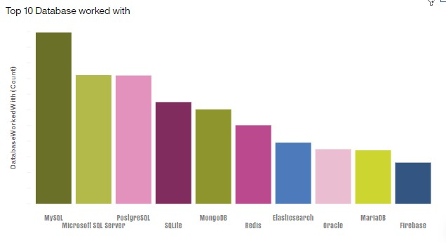
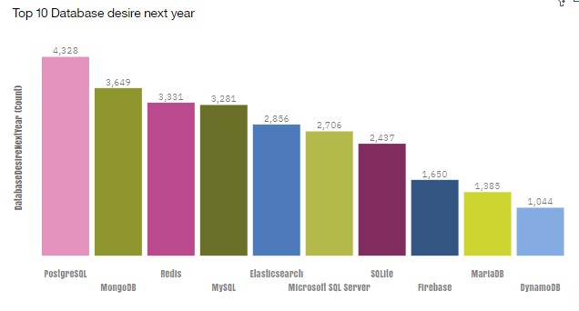
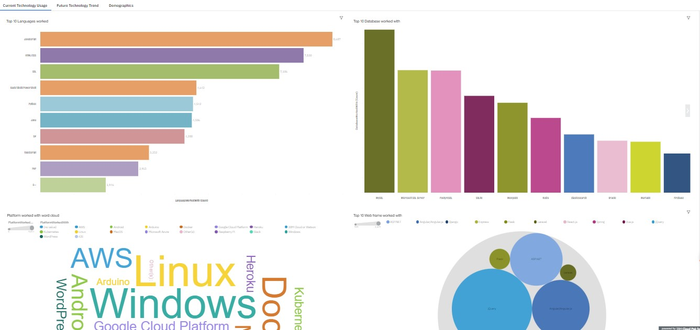

# Technology Trends Analysis
## A project to analyze technology trends using data obtained from APIs, Web Scraping and Survey data

## Introduction
In order to keep pace with changing technologies and remain competitive, organizations regularly analyze data to help identify current technologies as well as future skill requirements.
This project aim is therefore to carry out technology trend analysis which will start with collecting data from various sources and  clean it up to make it suitable for the analysis.

##  Problem statement 
1. __What are the skill requirements for future?__
2. __What are the top programming languages in demand?__
3. __What are the top database skills in demand?__
 
 
## Skills demonstrated.
- I used python for web scrapping and data retrival from api
- I used jupyter notebooks and vscode as IDE for the project
- I used IBM Cognos dashboard tool for visualization.

## Data sourcing
We scrape data of  the **name of the programming language** and **average annual salary** from the <a href="https://cf-courses-data.s3.us.cloud-object-storage.appdomain.cloud/IBM-DA0321EN-SkillsNetwork/labs/datasets/Programming_Languages.html">URL</a>  provided by skills network labs. 
We then write the scraped data into an csv file

We then use the <a href="https://developer.adzuna.com/">Adzuna API</a> to scrape data of number of technology jobs in some selected US cities and store them in an excel file 

We also use the Stack Overflow Developer Survey 2019 data to create a dashboard with IBM Cognos visualization tool to visualize and present our analysis 
Note:This randomised subset contains around 1/10th of the original data set.  Our Conclusions drawn after analyzing this subset may not reflect the real world scenario 
To access this dataset from IBM cloud <a href="https://cf-courses-data.s3.us.cloud-object-storage.appdomain.cloud/IBM-DA0321EN-SkillsNetwork/LargeData/m1_survey_data.csv">Click_HERE</a>

## Data transformation and cleaning.
1.  The survey dataset goes through various cleaning processes before being visualized in the IBM Cognos tool.
2.  Data from both the Api and scraped web page also undergoes cleaning and reformating before being visualized.

## Data analysis and visualization
Graph showing number of jobs generated by each technology
### key take ways from the graph above
- Java technology had the most number of job opportunities among all the languages
- The next three languages that followed according to job opportunities created were GO, SQL and Python

Graph showing salaries for different technologies
### Key observations from the graph above
- The swift language had the highest annual salary followed by Python, C++, Javascript, Java and then Go
- Apart from Java creating the most job opportunities, it does not top the table of the highest annual salaries but it takes the 5th position

Graph showing different number of jobs by each technology across various selected cities

Graph showing Top 10 databases  currently in use

Graph showing Top 10 databases  Desired Next
### key take aways from the graphs above
- MySQL most popular
- Microsoft SQL comes next in popularity after Mysql
- MongoDB and Redis are upcoming favorites
- New kid on the block: Elasticsearch
- Open source databases are still preferable in companies
- NoSQL databases will make an impact for storing non relational data
- Redis supports abstract data types
- Postgre databases is most likely to become very popular than MySQL in coming years

# Sample Cognos dashbaords
Model performance graph

A range of models were trained on the data and their performance assessed as seen in the bar graph above.
The gradient boosting classifier and the Random forest model were the best performing classifers.
Further analysis was performed to know which of them was the better model.The Random forest emerged as the slightly better model by comparing the performance of thier classification reports and confusion matrices. 
The best performing model was saved for use in the streamlit application.

## Model deployment
Streamlit Application user interface

## Conclussion

1. The clusters generated give us some useful information about our customer base such as their average income,
   age,debt to income ratio, education and years employed. 
2. We can use the statistics about these clusters to know where each customer belongs to.
3. With this information, we can then be able to tailor our bank products such as savings, loans, mortgage
   credit card to specific customers depending on the cluster they belong to for better performance of marketing     campaigns.

